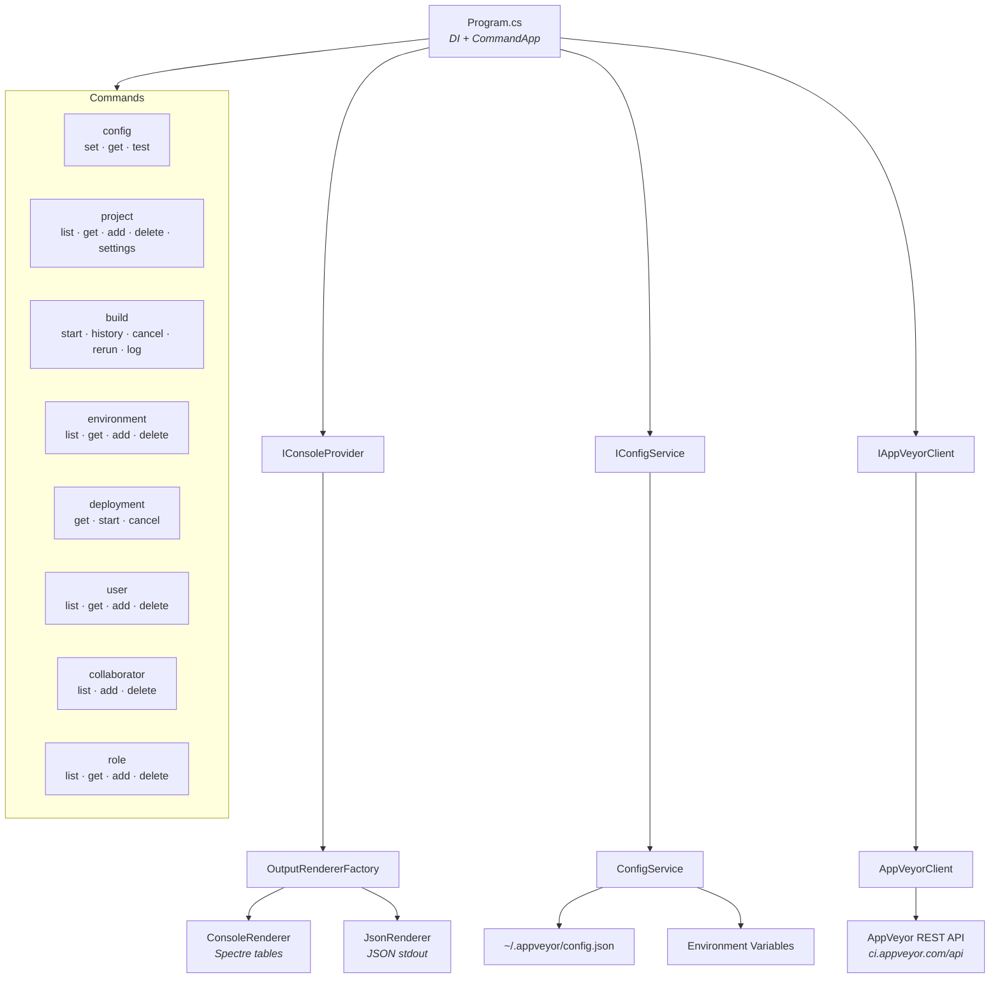
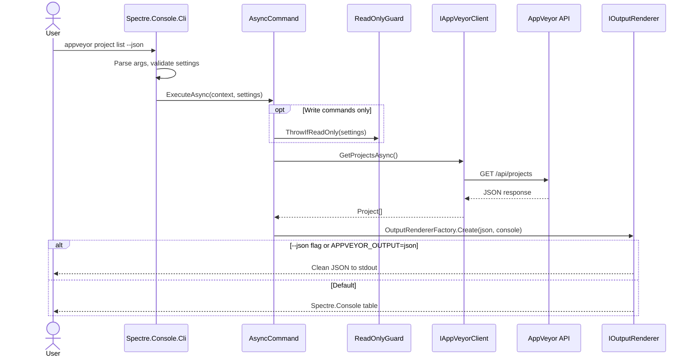

# Architecture

## Project Summary

AppVeyor CLI is a .NET 10 command-line tool for the AppVeyor CI/CD REST API. It uses Spectre.Console.Cli for structured command parsing, Spectre.Console for rich terminal output, and System.Text.Json source generators for AOT-compatible serialization. Every command supports dual output: rich Spectre tables for humans and clean JSON for AI agents and scripts.

## Module Map

## Command Flow

## Phases

| Phase | Name | Status | Summary |
|-------|------|--------|---------|
| 0 | [Design](phases/phase-0-design.md) | Complete | Scope, tech choices, command tree, architecture |
| 1 | [CLI Framework](phases/phase-1-cli-framework-and-scaffolding.md) | Complete | .NET 10 project, Spectre.Console.Cli, DI bridge |
| 2 | [API Client and Output](phases/phase-2-api-client-and-output.md) | Complete | Models, API client, dual output rendering |
| 3 | [Build and CI/CD](phases/phase-3-build-ci-cd.md) | Complete | Cake SDK, GitHub Actions, install scripts |
| 4 | [Commands and Features](phases/phase-4-commands-and-features.md) | Complete | 20 commands, read-only mode |
| 5 | [Testing](phases/phase-5-testing.md) | Complete | 31 tests, MockAppVeyorServer |

## Architecture Decision Records

| ADR | Decision | Date | Related Phase |
|-----|----------|------|---------------|
| [001](adr/001-spectre-console-over-system-commandline.md) | Spectre.Console.Cli over System.CommandLine | 2026-03 | Phase 1 |
| [002](adr/002-dual-output-rich-and-json.md) | Dual output: rich terminal + JSON | 2026-03 | Phase 2 |
| [003](adr/003-source-gen-json-serialization.md) | System.Text.Json source generators | 2026-03 | Phase 2 |
| [004](adr/004-cake-sdk-build-system.md) | Cake SDK build system | 2026-03 | Phase 3 |
| [005](adr/005-read-only-mode.md) | Read-only mode for safe exploration | 2026-03 | Phase 4 |
| [006](adr/006-console-provider-di-workaround.md) | IConsoleProvider DI workaround | 2026-03 | Phase 2 |

## Key Patterns

- **Command structure** -- Each command is an `AsyncCommand<TSettings>` with settings inheriting from `GlobalSettings`. Commands are organized in domain folders (Config, Projects, Builds, Environments, Deployments, Users, Collaborators, Roles).
- **DI bridge** -- `TypeRegistrar`/`TypeResolver` bridge Spectre.Console.Cli to Microsoft.Extensions.DependencyInjection. `IConsoleProvider` wraps `IAnsiConsole` to avoid Spectre's DI override.
- **Output abstraction** -- Commands call `OutputRendererFactory.Create(settings.Json, console)` and use the returned `IOutputRenderer` for all output. The renderer handles both Spectre tables and JSON serialization.
- **API client** -- Single `AppVeyorClient` using `HttpClient` with Bearer token auth. All paths are relative to the `/api/` base URL. Error responses are mapped to typed `AppVeyorApiException`.
- **Serialization** -- All models are C# records with `[JsonPropertyName]` attributes, registered in `AppVeyorJsonContext` for source-gen serialization. Reflection is disabled.
- **Read-only guard** -- Write commands call `ReadOnlyGuard.ThrowIfReadOnly(settings)` as the first line in `ExecuteAsync`.

## Developer Guidance

See [AGENTS.md](../AGENTS.md) for AI agent guidelines and step-by-step instructions for adding commands and models.
